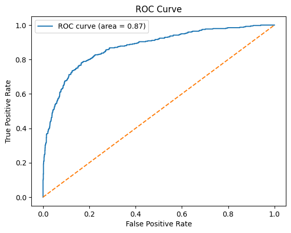

# Churn Prediction Project
Employing my machine learning techniques, I have identified a solution to the problem of customers requiring more attention to avoid becoming a burden for the bank. 


## Overview
This project analyzes customer churn data and builds multiple machine learning models to predict whether a customer will exit a service. The dataset includes customer demographics, account information, and usage patterns.

---

## Dataset
- **Source:** [kaggle data](https://www.kaggle.com/datasets/shrutimechlearn/churn-modelling/data)
- **Rows:** 10,000
- **Columns:** 15
- **Description:** Customer info such as CreditScore, Age, Balance, Geography, Gender, etc., with target variable `Exited`.

---

## Data Exploration & Preprocessing

- **Initial Inspection:**
  - No missing values or duplicate rows.
  - Mixed data types (numerical, categorical, boolean).
  
- **Encoding:**
  - `Gender` encoded with Label Encoding.
  - `Geography` one-hot encoded (`Germany`, `Spain`) with `France` dropped as baseline.

- **Feature Selection:**
  - Selected features:  
    `CreditScore, Age, Tenure, Balance, NumOfProducts, HasCrCard, IsActiveMember, EstimatedSalary, Gender, Geography_Spain, Geography_Germany`
  - Target variable: `Exited`

- **Data Splitting:**
  - Train-test split: 80/20 (random_state=42)
  - Train shape: (8000, 11)
  - Test shape: (2000, 11)

- **Scaling:**
  - Numerical features standardized using `StandardScaler`.

---

## Models Trained & Evaluation

| Model               | Accuracy | Precision (Churn) | Recall (Churn) | F1-score (Churn) | Comments                      |
|---------------------|----------|-------------------|----------------|------------------|-------------------------------|
| Random Forest       | 86.95%   | 0.78              | 0.47           | 0.59             | Best overall balance          |
| Logistic Regression | 81.1%    | 0.55              | 0.20           | 0.29             | Underperformed on recall      |
| SVM                 | 85.6%    | 0.77              | 0.38           | 0.51             | Good precision, low recall    |
| K-Nearest Neighbors | 83.15%   | 0.56              | 0.24           | 0.34             | Lowest recall, less reliable  |

- **Confusion matrices and classification reports** for all models included in analysis.
- **Feature importance** analyzed for Random Forest.
- **Feature coefficients** examined for Logistic Regression.

## ROC curve



---

## Insights & Recommendations

- **Random Forest** performs best in accuracy and F1-score tradeoff, but recall for churners is still low (~47%). This indicates many churners go undetected.
- The dataset is imbalanced (majority non-churners). Consider applying resampling techniques (SMOTE, ADASYN) or threshold tuning to improve recall.
- Logistic Regression and KNN models struggle with identifying churners, suggesting these methods may be too simplistic for this problem.
- Feature engineering (e.g., interaction terms, domain knowledge) might boost model performance.
- Further hyperparameter tuning and ensemble methods can be explored.

---

## Usage Instructions

1. Clone this repo.
2. Install dependencies:  
   ```bash
   pip install -r requirements.txt
3. Run Streamlit app
   ```bash
   streamlit run app.py

## Dashboard


## details 
- As a recent graduate, I have gained valuable experience through various projects.
- This particular project serves as a learning endeavor, where I aim to understand the intricacies of churn,
- the factors that contribute to churn, and the role of machine learning in identifying churn patterns.Currently,
- I am actively seeking employment opportunities that will allow me to effectively apply my acquired experience.
- **Notebook:**[kaggle notebook](https://www.kaggle.com/code/venkateshpvnky/chunk-prediction-for-bank)

## contact details 

Contact
For questions or collaboration, reach out to:

Venkatesh P
- Machine Learning Engineer & Student

<p align="center">
  <a href="https://www.datascienceportfol.io/venkateshml" target="_blank">
    
  </a>
  <a href="https://linkedin.com/in/venkatesh-ml" target="_blank">
    
  </a>
  <a href="https://github.com/venkatesh-hyper" target="_blank">
    
  </a>
  <a href="mailto:venkateshpvnky9@gmail.com" target="_blank">
    
  </a>
</p>

